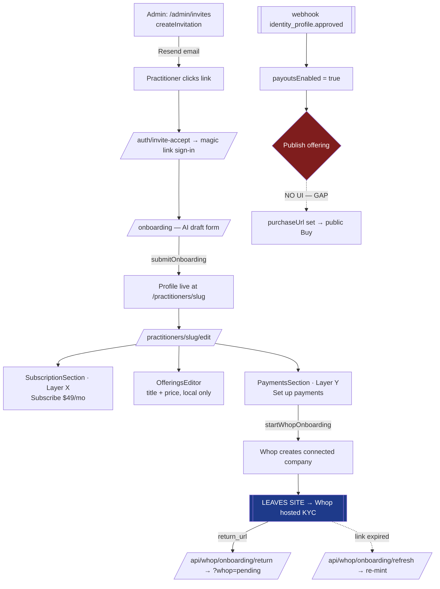
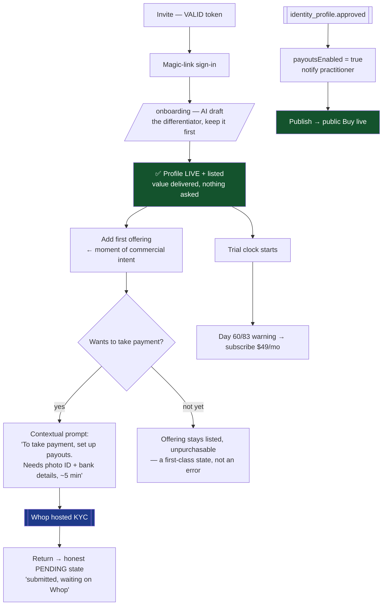

# Whop journeys + e2e eval design

> Written 2026-07-29, after Connected Accounts shipped (PR #37). Companion to
> `docs/PHASE-2C-WHOP-CONNECTED-ACCOUNTS.md`, which covers the API/architecture.
> This doc covers the **user journeys** and **how we prove they work**.

## 0. Verified production state

Read-only snapshot of the live DB, 2026-07-29:

| | |
|---|---|
| Practitioners | **14** (all `acceptedAt` set) |
| `trialEndsAt = null` (pre-trial, listed free, no clock) | **14** |
| Trials running / expired | **0 / 0** |
| `subscriptionStatus = ACTIVE` | **0** |
| Admins (paywall-exempt) | 2 |
| Connected accounts (`whopCompanyId`) | **0** |
| `whopPayoutsEnabled` | **0** |
| Practitioners with offerings | 1 (catalog-only) |
| Invitations: accepted / valid-pending / **expired** | 3 / **0** / **13** |

Three facts worth stating plainly:

1. **No revenue path has ever completed end-to-end.** Zero active subscriptions, zero connected accounts. Both Layer X and Layer Y are unexercised in production.
2. **The trial clock has never started for anyone.** All 14 are `trialEndsAt: null`, which `isListed()` treats as "pre-trial — still listed". Everyone is listed free, indefinitely, with no countdown and no conversion moment.
3. **Nobody new can onboard right now.** 13 expired invitations, 0 valid. `resendInvitation` exists and re-issues a fresh token; it just hasn't been run.

## 1. ✅ FIXED — the gap found while mapping this

> **Closed 2026-07-29.** `OfferingsEditor` now renders a per-offering publish control in three
> states: **published** (Live badge + Unpublish), **ready** (Publish button), and **blocked**
> (inline "set up payouts to sell this online" linking to `#payments`). Implemented as
> `formAction` buttons inside the existing row form — no nested forms. `purchaseUrl` is now
> threaded through the page's offerings mapping, without which every row would have looked
> unpublished forever.
>
> The blocked state is deliberately not a disabled button: an offering without online checkout is
> a legitimate state (bookings still work via the practitioner's booking link), so it gets
> matter-of-fact copy rather than error styling.

The original finding, kept because it is the clearest argument for the eval design below:

**`publishOffering` / `unpublishOffering` were implemented but wired to no UI.**

The server actions exist and are correct. `OfferingsEditor.tsx` was never updated to call them — it wasn't assigned an owner when the work was partitioned by file. Consequence: a practitioner can enrol, pass KYC, and reach `payoutsEnabled: true`, then find **no button to publish an offering**. `purchaseUrl` stays null forever, so the public Buy CTA — correctly gated on `purchaseUrl` — never appears.

**The Layer Y chain is broken at the last mile.** Nothing in `tsc`, `lint`, or code review caught it, because every individual piece is correct; only the *seam* is missing. This is the single best argument for the eval design below: a journey test asserting "practitioner with payouts enabled can publish, and a patient then sees Buy" would have failed immediately.

## 2. Practitioner onboarding journey

### 2.1 What exists today



On the edit page the cards render in this order: **Subscribe (Layer X) → Offerings → Payments (Layer Y)**.

### 2.2 What's wrong with that ordering

- **The two money conversations sit adjacent and read as one.** "Subscribe · $49/mo" (they pay us) is a few hundred pixels from "Set up payments" (patients pay them). These are opposite directions of cash flow. A practitioner who conflates them either thinks the $49 is a payment-processing fee, or thinks setting up payouts is what they're being billed for.
- **Payment setup is presented as a chore, not a consequence of intent.** It's a card at the bottom of a long form. Nothing connects it to *wanting to sell something*.
- **The gate is invisible until you hit it.** `publishOffering` hard-gates on `payoutsEnabled`. A practitioner naturally adds offerings first (that card comes first), and only discovers the payout requirement when publishing fails.
- **The trial is never framed as a clock.** With `trialEndsAt: null` there is no countdown, no conversion moment, and no reason to ever subscribe.

### 2.3 Optimal journey

The reordering principle: **ask for payment setup at the moment of commercial intent, and never ask for money before delivering value.**



Concrete changes this implies:

| # | Change | Why |
|---|---|---|
| 1 | **Wire `publishOffering` into `OfferingsEditor`** | §1 — the chain is broken without it |
| 2 | Move the payouts CTA **into the offering row** ("Not accepting payment yet — set up payouts") | Triggers at intent, not as a chore |
| 3 | Rename the cards so direction of money is unmissable — e.g. **"Your directory listing"** vs **"Getting paid by patients"** | They currently read as one topic |
| 4 | Pre-flight expectations before the Whop jump: photo ID, bank details, ~5 min | Highest drop-off point in the funnel is a handoff to a stranger's KYC form |
| 5 | Notify on `identity_profile.approved` | Approval is async; without a nudge they never come back to publish |
| 6 | Start the trial clock on genuine onboarding | 14 practitioners have no clock and no conversion moment |
| 7 | Offering-without-checkout stays a first-class state | Some practitioners will never take online payment; that must not look broken |

### 2.4 The handoff, precisely

The only leg that leaves our domain:

```
naturalhealthpros.com/practitioners/<slug>/edit#payments
   │  startWhopOnboarding (server action)
   │    ├─ POST /v1/companies  { parent_company_id, email, metadata.practitioner_id }
   │    │    → persists whopCompanyId IMMEDIATELY (idempotency guard)
   │    └─ POST /v1/account_links { use_case: account_onboarding, return_url, refresh_url }
   ▼
whop.com/payouts/<biz_id>/verify        ← identity + bank, Whop-hosted, short-lived link
   │  ├─ completes  → return_url  → /api/whop/onboarding/return?slug=…  → ?whop=pending
   │  └─ link died  → refresh_url → /api/whop/onboarding/refresh?slug=… → re-mint, bounce back
   ▼
(async, minutes→days)  webhook identity_profile.approved → payoutsEnabled = true
```

Two properties worth preserving: the **return is not the approval** (return fires on form submit; the webhook is truth), and **we build no KYC, no bank-detail, and no payout UI** — all of it is Whop-hosted, including the ongoing `payouts_portal`.

## 3. e2e eval design

### 3.1 The constraint that shapes everything

**Whop's KYC is a third-party hosted flow with real identity verification. It cannot be automated in CI.** Any plan promising "full e2e coverage" is either flaky or fake. So the design deliberately splits the journey at that boundary and covers each side with the cheapest sufficient tool.

### ✅ Built 2026-07-29 — `npm test` (37 tests, ~0.6s, zero external deps)

Vitest 3 (node env, `@/` → `src/`). **L1 and L2 are done.**

| File | Covers |
|---|---|
| `tests/helpers/whop-webhook.ts` | Standard Webhooks signer — forges genuinely-valid deliveries offline |
| `tests/whop-webhook-signature.test.ts` (3) | Proves the signer is accepted by Whop's **real** verifier; tampered body and wrong secret both rejected |
| `tests/whop-webhook-v1.test.ts` (16) | The v1 route: signature/config, payout transitions, resolution order, delivery semantics |
| `tests/listing-gate.test.ts` (18) | `isListed()` / `isProfileComplete()` — the function converting billing state into visibility |

Design choice: **the DB and indexer are mocked; the crypto is real.** Signature verification genuinely
executes, so the 401 tests prove something. Mocking `@/lib/whop` would have made them vacuous.

The signature helper is load-bearing — every forged delivery depends on it — so
`whop-webhook-signature.test.ts` asserts the round-trip against the SDK's own verifier. Without
that, a wrong scheme would make every webhook test pass while exercising a rejected request.

**Mutation-tested.** Two deliberate regressions were injected to confirm the suite actually fails:
returning `500` on handler failure, and dropping the `webhook-id` dedupe key. Both were caught by
exactly one test each; the route was then restored byte-identical.

Still to build: **L4** (Playwright journeys) and **L3** (sandbox contract tests). L4 is deferred
because authenticated write journeys need a test-database story and magic-link automation —
building it without those produces flaky tests, which are worse than none. L3 is deferred until a
real connected account exists to reconcile against.

### 3.2 Layers

| Layer | What | External dep | Runs |
|---|---|---|---|
| **L1** Pure logic | `isListed()`, `isProfileComplete()`, payout-status → UI mapping, price formatting | none | every commit |
| **L2** Webhook simulation | Signed Standard Webhooks payloads → route → assert DB + reindex | none | every commit |
| **L3** Contract tests | Whop **sandbox**: the exact request shapes we depend on | Whop sandbox | nightly |
| **L4** Journey tests | Playwright, Whop stubbed at the HTTP boundary | none | every PR |
| **L5** Manual smoke | The real hosted KYC leg | Whop sandbox | per release |
| **L6** Prod canaries | Drift + stuck-state detection | prod | continuous |

Build order by risk × cost: **L2 → L1 → L4 → L3 → L6 → L5.**

### 3.3 L2 — webhook simulation (highest value, lowest cost)

This tier tests the logic that decides whether money can move, with **zero external dependency**. Standard Webhooks signatures are computable locally: `HMAC-SHA256("{id}.{timestamp}.{body}")` with the base64-decoded secret.

| Case | Assert |
|---|---|
| `identity_profile.approved` | `payoutsEnabled=true`, `payoutStatus='connected'`, reindex called |
| `identity_profile.rejected` / `.needs_action` | `payoutsEnabled=false`, correct status |
| `payout_account.status_updated` with **unknown** status string | persisted verbatim, **no throw** |
| Bad signature | `401`, no DB write |
| No secret configured | `503` |
| Same `webhook-id` twice | one audit row, idempotent state |
| Handler throws (DB down) | still returns **2xx** — Whop drops events after ~70s of retries |
| Unresolvable practitioner | `200`, event recorded, no crash |
| Child-webhook secret only | still verifies (two-secret path) |

### 3.4 L4 — journey tests, Whop stubbed at the boundary

Stub only outbound `api.whop.com` calls; everything else is real.

**Journey A — practitioner onboarding (the one in §2.3)**
invite → accept → magic link → `/onboarding` → profile live → add offering → payouts CTA → assert redirect target is a Whop account link → inject `identity_profile.approved` → **publish** → assert `purchaseUrl` set → assert public profile shows Buy.

*This journey fails today at "publish" — §1.*

**Journey B — patient discovery → purchase intent**
search → profile → Buy visible only when `purchaseUrl` set → link targets `whop.com/checkout/...`.

**Journey C — listing gate**
incomplete profile → not in search; complete + pre-trial → listed; trial expired + no subscription → delisted; `PAST_DUE` → **still listed** (dunning grace); ADMIN → always listed.

**Journey D — authorization**
non-owner and signed-out hits on `/api/whop/onboarding/{return,refresh}`, `/edit`, `/admin/connected-accounts` → redirect, never 500, never another practitioner's state.

### 3.5 L3 — contract tests vs sandbox

We discovered by probing that the published docs and the generated SDK **disagree**, and that Whop rejects unknown parameters outright. Nothing tells us if that shifts again — a silent contract change would break checkout in production with no local signal.

Assert against `sandbox-api.whop.com`:
- `POST /companies` with `parent_company_id` + `email` → returns `biz_`
- `POST /checkout_configurations` accepts `plan.company_id` (**not** `account_id`), inline `plan.product`, `application_fee_amount`
- `POST /account_links` for both `account_onboarding` and `payouts_portal`
- `POST /webhooks` still requires `resource_id`
- `GET /payout_accounts/{biz}` 404s when no payout account exists
- `GET /companies?parent_company_id=` lists connected accounts

Nightly, not per-PR — an external dependency in a merge gate is a flaky merge gate.

### 3.6 Money-safety cases (highest severity)

These map to real financial harm, not cosmetic bugs:

1. **`publishOffering` with `payoutsEnabled=false` must create nothing on Whop.** A patient paying into a non-withdrawable account is the worst outcome in the system.
2. **Double-submit `startWhopOnboarding` must not create two connected companies.** Current protection is read-then-write with a genuine race window; the reconciliation page is the safety net, not a fix.
3. **`applicationFeeCents = 0` must OMIT the field** — Whop rejects a non-positive fee, so a regression here fails checkout outright.
4. **Layer X and Layer Y must never cross companies.** Subscription checkout on `biz_Vpj1G2ryNdPCG0`; offering checkout on the practitioner's connected company. Crossing them misroutes revenue.
5. **`PAST_DUE` must remain listed.** Delisting during Whop's dunning grace destroys trust for a recoverable card failure.

### 3.7 ✅ L6 — production canaries — `npm run whop:health`

Built 2026-07-29 as `scripts/whop-health.ts`. Read-only, safe against production. **12/12 passing.**

KYC can't be tested, so this detects its failure modes after the fact:

| Check | Catches |
|---|---|
| Public surfaces `200`, gated `307` | A gate silently opening |
| `/api/whop/webhook/v1` unsigned → **`401` not `503`** | Secret not bound in the running deploy — Vercel binds env at deploy time, so a secret added after a deploy stays inert until the next one |
| Legacy webhook still `401` | Layer X revenue path broken during the `@whop/api` retirement |
| Stalled verifications (>7d, company created, payouts still off) | Practitioner left for Whop and never came back |
| `payoutsEnabled` but zero offerings | Funnel leak — completed KYC that never converted. **This is the §1 gap's exact fingerprint**, which is why it stays after the fix |
| `WhopWebhookEvent.processedAt` null / `error` set | Handler failures |
| Drift vs `GET /companies?parent_company_id=` | Dropped webhooks — Whop stops retrying after ~70s, so a lost delivery is permanent and reconciliation is the only thing that surfaces it |

Exits non-zero on failure, so it can go straight into cron or a deploy gate.

## 4. Sequence — status

| # | Step | Status |
|---|---|---|
| 1 | Wire `publishOffering` into `OfferingsEditor` | ✅ done — §1 |
| 2 | L2 webhook sims (+ L1 gate logic) | ✅ done — 37 tests, mutation-verified |
| 3 | L6 production canaries | ✅ done — `npm run whop:health`, 12/12 |
| 4 | **Re-issue invitations** | ⛔ **operator** — sends real email to 13 people |
| 5 | **Trial-clock policy** | ⛔ **operator decision** |
| 6 | **First real enrolment** (sandbox → prod) | ⛔ **operator** — needs a real identity for KYC |
| 7 | L3 contract tests | ⏳ blocked on #6 — needs a connected account to reconcile |
| 8 | L4 Playwright journeys | ⏳ needs a test-DB + magic-link story first |

Steps 4–6 are deliberately not automated. #4 sends real email to real practitioners, and #6
requires a genuine identity document — neither is something to fire without an explicit go.
